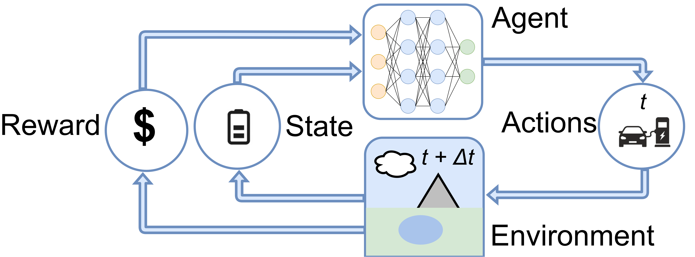
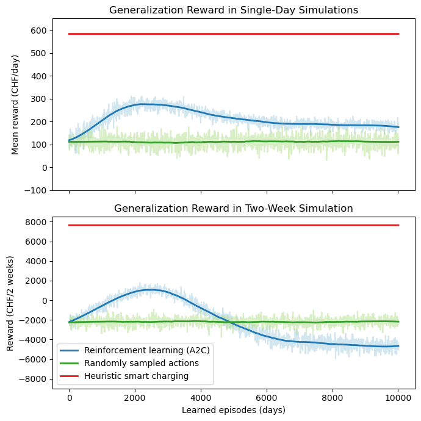

# A Reinforcement Learning Environment for Vehicle-to-Grid Charging Strategies in Car-Sharing
This repository contains an open-source simulation environment designed for testing and optimizing vehicle-to-grid (V2G) charging strategies in car sharing systems. The environment supports a range of reinforcement learning algorithms and can be used to test other approaches and strategies as well. The environment includes a tuple observation space and a discrete action space, along with a reward function that represents a broad range of economic costs and revenues, including opportunity costs. The reward function encourages efficient charging and discharging of vehicles, while taking into account factors such as energy prices, penalties, and revenue from renting out vehicles.<br />
<br />
**Author:** Dominik J. Mühlematter<br />
**Supervisors:** Nina Wiedemann, Henry Martin, Prof. Dr. Martin Raubal<br />
Geomatics Master Project, Spring Semester 2023<br />
Institute of Cartography and Geoinformation, ETH Zurich<br />

## Installation:
This repo can then be installed in editable mode. In an activated virtual environment, cd into this folder and run
```
pip install -e .
```
This will execute the `setup.py` file and install required dependencies.

## Motivation:
Integrating renewable energy sources is challenging due to fluctuations  in energy production. A promising approach lies in utilizing Vehicle-to Grid (V2G) technology; the energy grid can be stabilized by charging  electric vehicles during energy overproduction and discharging energy to the grid during periods of underproduction. Car-sharing companies can benefit from additional revenues by offering flexible energy supply, which is delivered if needed (V2G events). Simultaneously meeting the demands of car-sharing and energy requires intelligent charging strategies. This project aims to develop simulation software that can be used to optimize and test analytical, heuristic, and reinforcement learning-based V2G charging strategies.

## Software Design for Simulation:
The software was implemented with Python based on the OpenAI Gym standard [1]. The simulation uses historical energy prices and booking data from Switzerland's car-sharing provider “Mobility”, with the assumption of a fully electric vehicle fleet, as planned by the year 2030. V2G events and initial vehicle battery levels are generated randomly. The figure below shows the procedure, which simulates the car-sharing system for a discrete timestep of fifteen minutes per iteration. The software allows to investigate charging strategies for time periods of arbitrary length.



**Agent**<br />
Car-sharing provider using algorithm for deciding actions<br />
<br />
**Actions**<br />
Charging, discharging, or do nothing at time t for each car<br />
<br />
**Environment**<br />
Simulates system at future timestamp (+15min):<br />
• Charge/discharge vehicles <br />
• Simulate trips based on historical data<br />
• Spatial car-assignment: Assign customers to nearby available <br />
vehicles if booked car is not enough charged for planned trip<br />
<br />
**Reward**<br />
Calculates monetary profit earned during last timestep<br />
• Car-sharing operations (charging costs, trip revenue, V2G revenue)<br />
• Penalties for not serving contractual energy or car-sharing demand<br />
<br />
**State**<br />
Updates agent's observations of car-sharing system vehicle <br />
• Vehicle locations (station/trip) and battery levels<br />
• Planned bookings<br />
• Required V2G energy demand for the next timestep<br />
<br />
A tutorial is can be found here: [simulation_tutorial.ipynb](https://github.com/mie-lab/v2g_thesis/blob/main/simulation_tutorial.ipynb).

## Optimization using Reinforcement Learning and Heuristic Methods
As part of the project, a deep reinforcement learning (RL) algorithm called A2C [2] and a heuristic-based method were developed for testing the simulation software. A realistic case study was conducted to evaluate both charging algorithms at the same time. The RL algorithm was trained and fine-tuned using independent days within the time period from 1st August 2019 to 11th March 2019, treating each day as an independent episode. The hyperparameters of the heuristic method were also tuned using the same time period. The case study was performed on a small vehicle fleet of fifteen cars, for reducing computationally costs. Afterwards, both algorithms were tested for generalization performance using two weeks from 12th March 2019 to 26th March 2019 to estimate the expected reward on independent data.



In the figure above, the left graph illustrates the average daily reward obtained through independent simulations for each day (each day is newly initialized). The heuristic method demonstrated superior performance, outperforming even the RL approach, although the RL approach still exceeded a randomly sampled strategy significantly. On the right side, the figure represents the reward achieved through continuous simulation over the two weeks. Notably, the RL algorithm exhibited robust generalization capabilities for long-term application, despite being trained on episodes of only 24 hours. Both plots indicate a decline in reward obtained by the RL approach as the number of trained days increases, which could be attributed to overfitting.<br />
<br />
The analysis as part of a tutorial can be found here: [reinforcement_learning_tutorial.ipynb](https://github.com/mie-lab/v2g_thesis/blob/main/reinforcement_learning_tutorial.ipynb)).


## Conclusion and Outlook
• The software has proven to be a valuable tool for developing and 
testing charging strategies in car-sharing systems<br />
• RL approaches have shown significant potential for charging 
optimization. More extensive feature selection and fine-tuning of the 
A2C algorithm may lead to near-optimal charging strategies<br />
• The high computational costs of RL algorithms, especially when 
simulating large vehicle fleets, present a significant drawback that 
necessitates further research to address this challenge<br />


## References
[1] Brockman, G., Cheung, V., Pettersson, L., Schneider, J., Schulman, J., Tang, J., & Zaremba, W. (2016). OpenAI Gym [Computer software]. https://gym.openai.com/<br />
[2] Mnih, V., Puigdomènech Badia, A., Mirza, M., Graves, A., Lillicrap, T. P., Harley, T., Silver, D., &  Kavukcuoglu, K. (2016). Asynchronous Methods for Deep Reinforcement Learning. arXiv preprint arXiv:1602.01783.<br />
